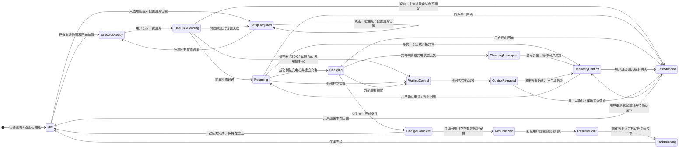
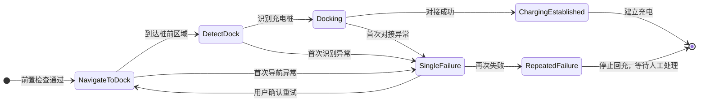

# 回充状态机图

本图只保留影响用户操作和任务流转的状态。具体导航、识别、对接和充电阶段属于回充执行子状态，不在页面中逐项展开。

## 回充执行子状态

## 关键转移约束

- 一键回充完成后保持在充电桩，不自动恢复导览任务。
- 自动回充完成后，只有存在有效恢复安排时才离桩；没有恢复安排时回到任务起点并启动首步骤。
- 低电提醒由用户确认是否在当前讲解完成后回充；紧急缺电直接停止当前任务进入回充，但恢复或退出仍由用户确认。
- 遥控器、SDK 或其他 App 接管时不抢占控制权。控制权释放后只弹出确认，不由机器人自行恢复。
- 新任务可以清除旧任务的恢复安排，但保留“是否恢复自动回充”的待确认操作。
