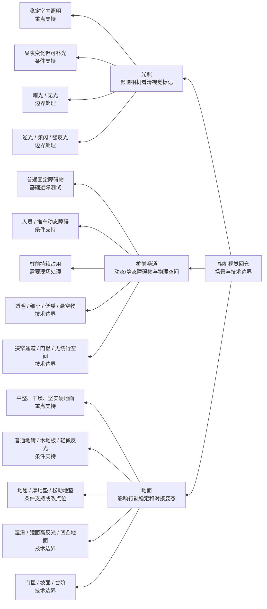

# 相机视觉回充：典型场景与技术边界共识稿

> **文档状态**：评审草稿  
> **适用对象**：产品、算法、导航、硬件、测试、交付  
> **当前产品基线**：导览 App / T1 / 相机视觉近场对接方案  
> **唯一目的**：先统一场景和技术边界，再据此制定测试范围、部署要求和后续产品手册

## 1. 这份文档要统一什么

当前方案的物理链路已经确定：

1. 机器人沿已设置地图导航到充电桩前的预对接区域。
2. 激光雷达负责导航和基础障碍检测。
3. 前置相机识别充电桩视觉标记，完成低速近场对接。
4. 只有检测到真实充电状态，才算回充成功。

本稿只讨论**视觉对接相关的回充点环境条件**，固定为三个维度：

- **光照**：包括环境照明、逆光/反光，以及视觉标记是否清楚可见。
- **桩前畅通**：包括动态和静态障碍物，以及机器人进入预对接区和充电桩前的物理空间。
- **地面**：包括平整度、附着力、打滑风险和可能影响相机判断的地面反光。

不讨论自动回充策略、任务恢复、页面交互或异常弹窗。地图、机器人姿态、充电桩供电和控制权属于自动回充全链路的其他前置条件，不作为本稿的第四类环境维度。

## 2. 统一判断口径

| 判断项 | 本稿口径 |
| --- | --- |
| 高频 | 目标业务中可能经常出现的现场条件。当前没有四个行业的现场统计，因此标记为“频次假设”或“待现场确认”，不当作数据结论。 |
| 高价值 | 一旦处理不好，会直接阻断自动回充、降低连续作业能力或带来移动安全风险。 |
| 技术边界可支持 | 在明确环境前提下，当前方案可以作为重点测试对象，并有机会建立稳定准确率基线。 |
| 条件支持 | 技术可以尝试，但必须通过现场验证或环境改造，不能直接承诺跨场景稳定可用。 |
| 技术边界可能达不到 | 仅靠当前激光雷达基础避障和相机视觉对接难以稳定解决，应优先改变环境或采用人工回充。 |

## 3. 左向场景总览

这类图叫**左向思维导图**、**从右向左的思维导图**或**左向树状思维导图**。它不是一个新的图学类型，表达的是“根节点在右侧，信息向左展开”的布局；在 Mermaid 中使用 `flowchart RL`。

## 4. 光照维度

光照影响相机能否稳定看到充电桩视觉标记。它直接影响近场识别和对接，不等同于“机器人能否导航到桩前”。

| 具体情况 | 典型代表场景 | 高频 / 高价值判断 | 技术判断 | 现场替代或处理 |
| --- | --- | --- | --- | --- |
| 固定室内、照明稳定、标记清楚可见 | 展厅导览：固定展厅充电点 | 高频假设：是；高价值：是 | **技术边界可支持，首批重点测试** | 固定充电桩，保持标记无遮挡；作为准确率基线 |
| 白天和夜间亮度变化，但可保持连续照明 | 物业巡检：办公楼或园区夜间巡检 | 高频假设：是；高价值：是 | **条件支持**；可验证，但不能把白天结果直接外推到夜间 | 为充电桩提供持续稳定的照明；白天、夜间分别验证 |
| 后场偏暗、夜间照明可能关闭或完全无光 | 智慧药房：夜间后场取药和配送 | 高频：待现场确认；高价值：是 | **当前不能承诺稳定支持**；相机可能无法稳定识别标记 | 增加固定补光并设置为持续开启；无法补光时人工回充 |
| 强逆光、窗光直射、灯光频闪、射灯直射或强反光 | 商场导购：橱窗、玻璃和射灯附近 | 高频：待现场确认；高价值：是 | **技术边界可能达不到**；识别结果可能不稳定 | 调整充电桩朝向或点位，避开直射和强反光；仍无法改善时人工回充 |

### 光照共识

- “稳定室内照明 + 标记清楚可见”是四个业务共享的首批测试基线。
- 夜间、后场偏暗属于高价值场景，但是否高频、补光后能否稳定支持，需要现场数据和真机测试确认。
- 逆光、频闪、强反光和完全黑暗不能通过反复重试解决，应优先做环境改造。

## 5. 桩前畅通维度

“桩前畅通”不是只看有没有障碍物，还要看机器人是否有足够的进桩空间。分析时同时覆盖：导航路线上的动态/静态障碍物、预对接区的可通行空间，以及充电桩前的近场对接空间。当前激光雷达只提供基础障碍检测，不能假设它能稳定识别所有物体。

| 具体情况 | 典型代表场景 | 高频 / 高价值判断 | 技术判断 | 现场替代或处理 |
| --- | --- | --- | --- | --- |
| 普通固定障碍物，尺寸和位置可被基础避障发现，且有绕行空间 | 物业巡检：保洁车、普通箱体出现在固定路线 | 高频假设：是；高价值：是 | **技术边界可支持但需留余量**；沿用基础导航避障逻辑 | 保持路线宽度和绕行空间；不要把障碍物长期堆在回充路线 |
| 人员、购物车、推车等动态障碍物短时占用导航路线 | 商场导购：营业高峰人流和购物车 | 高频假设：是；高价值：是 | **导航段条件支持**；动态障碍不可直接作为近场对接保证 | 可测试导航段；在机器人进入桩前对接前，必须清空桩前区域 |
| 充电桩前约 1 米持续有人、推车、箱子、清洁工具或展品 | 展厅导览：观众或展品堵住充电桩前 | 高频假设：是；高价值：是 | **当前技术不支持持续占用条件下的稳定对接**；会停止等待处理 | 设置充电桩空置区、调整点位或安排空闲时段；无法清空时人工处理 |
| 透明、细小、低矮、悬空障碍物，可能不在稳定扫描范围内 | 智慧药房：玻璃设施、低矮货箱或悬空物料 | 高频：待现场确认；高价值：是 | **技术边界可能达不到**；不能承诺基础激光雷达稳定发现 | 清理、隔离或改变摆放；不要依赖机器人自动穿过该区域 |
| 路线狭窄、存在门槛，或没有绕行空间 | 物业巡检：办公楼入口和过渡通道 | 高频：待现场确认；高价值：是 | **技术边界可能达不到**；导航和近场对接都缺少空间余量 | 更换充电桩点位或改造通行条件；无法改造时人工回充 |

### 桩前畅通共识

- 普通、可被发现且有绕行空间的障碍物，是基础避障能力的重点测试对象。
- 人流可以作为导航段的真实测试条件，但不能把“导航能绕开人”外推成“桩前有人也能完成对接”。
- 桩前持续占用、透明/细小/悬空物、没有绕行空间，是当前方案需要通过现场管理解决的条件，不应直接变成算法保证项。

## 6. 地面维度

地面影响底盘是否打滑、机器人到达桩前的姿态是否稳定，以及视觉对接时能否保持可控的运动状态。

| 具体情况 | 典型代表场景 | 高频 / 高价值判断 | 技术判断 | 现场替代或处理 |
| --- | --- | --- | --- | --- |
| 平整、干燥、坚实、连续的硬质地面 | 展厅导览：固定展厅硬质地面 | 高频假设：是；高价值：是 | **技术边界可支持，首批重点测试** | 固定充电桩；保持地面干燥平整 |
| 普通地砖或木地板，存在轻微反光但不打滑 | 商场导购：店内地砖和固定通道 | 高频假设：是；高价值：是 | **条件支持**；需同时验证行驶稳定和标记可见性 | 选择反光较弱的点位；必要时调整充电桩朝向 |
| 地毯、厚地垫或松动地垫 | 物业巡检：办公楼入口或过渡区域 | 高频：待现场确认；高价值：是 | **条件支持偏弱**；软地面或地垫移动可能改变姿态 | 移除或固定地垫；优先把充电桩放到硬质地面 |
| 积水、湿滑、镜面高反光或明显凹凸地面 | 智慧药房：清洁后湿滑地面或设备区域 | 高频：待现场确认；高价值：是 | **技术边界可能达不到**；可能打滑、偏移或产生视觉干扰 | 等地面干燥或更换点位；无法调整时人工回充 |
| 门槛、坡面、台阶，或必须经过明显高差 | 物业巡检：通道门槛、坡道或楼层过渡处 | 高频：待现场确认；高价值：是 | **当前不作为稳定自动回充条件** | 将充电桩放在同一连续平面；无法调整时人工回充 |

### 地面共识

- “平整、干燥、坚实的硬质地面”是四个业务共享的首批测试基线。
- 普通地砖和木地板属于高价值、频次可能较高的实际环境，但需要单独验证反光和打滑。
- 地毯、松动地垫、湿滑、镜面、门槛、坡面和台阶不应直接作为稳定支持环境。

## 7. 统一结论：先支持什么，哪些交给现场

### 7.1 当前应建立准确率基线的组合

这组组合同时满足“高频假设”和“高价值”，应作为四类业务的共同测试基线：

- 固定室内场地。
- 充电桩标记清楚可见，照明稳定。
- 路线上为普通可发现障碍物，并有基本绕行空间。
- 充电桩前约 1 米无人员、推车、箱子、清洁工具或展品占用。
- 充电桩位于平整、干燥、坚实的硬质地面，并保持固定。

对应代表：展厅导览固定展厅、物业巡检固定室内路线、商场导购店内固定路线、智慧药房后场固定通道。

### 7.2 高频高价值，但只能条件支持的组合

- 昼夜亮度变化，但可以持续补光：物业巡检、智慧药房。
- 营业高峰动态人流：商场导购、展厅导览；只对导航段做条件验证，对接前必须清空桩前。
- 普通地砖、木地板和轻微反光：商场导购、智慧药房；先验证不打滑和标记可见。
- 路线上偶发推车、保洁车和物料：物业巡检、商场导购；必须保留绕行空间。

这些不是“默认支持”，而是“环境可调整、现场可验证后支持”。

### 7.3 当前技术边界可能达不到的组合

- 没有稳定照明的暗光/无光环境。
- 强逆光、频闪、强反光直射相机的环境。
- 桩前长期有人或物品占用，无法保持约 1 米空置。
- 透明、细小、低矮、悬空等激光雷达可能难以稳定发现的障碍物。
- 湿滑、镜面高反光、厚地垫、门槛、坡面、台阶和明显凹凸地面。

### 7.4 不能靠技术解决时的最简单方案

按成本从低到高统一处理：

1. **改环境**：补充稳定照明、清理桩前区域、移除或固定地垫、把充电桩移到平整硬地面。
2. **改运营时段**：避开高峰人流和清洁作业，在桩前可以清空时执行回充。
3. **改充电点位**：避开逆光、玻璃强反光、门槛、坡面和狭窄通道。
4. **人工回充**：现场条件无法改变时，由人员把机器人移到充电桩处，不把不稳定环境强行纳入自动回充承诺。

充电桩移动或改变朝向后，需要重新设置回充位置；不要继续使用旧位置配置判断技术是否失效。

## 8. 网络连接是否纳入视觉对接判断

网络不是光照、桩前畅通或地面的现场环境维度。是否需要把网络列入视觉对接技术依赖，取决于视觉识别和对接控制的实际部署方式：

| 实现方式 | 是否纳入视觉对接场景矩阵 | 需要验证的内容 |
| --- | --- | --- |
| 相机图像处理、视觉识别和近场控制都在机器人本地执行 | **不纳入** | 网络断开不应改变本地视觉对接本身；另行验证 App 状态是否能正常同步 |
| 相机图像上传远端处理，或对接控制指令依赖远程链路 | **纳入系统技术依赖，但不新增环境维度** | 延迟、丢包、断网时是否安全停止；不能在失去有效控制时继续盲目对接 |

因此，本轮应先由研发确认视觉链路是否本地闭环。确认本地闭环后，网络只放在自动回充的系统联调检查中，不进入三维度场景分析；如果不是本地闭环，再补充网络异常对视觉识别和对接控制的专项测试。

同理，地图有效性、机器人回充姿态、外部控制权和充电桩供电状态，属于自动回充全流程的其他检查项，不在本稿中扩展为新的环境维度。

## 9. 建议的测试推进顺序

1. 先验证共同基线，不同时叠加压力条件。
2. 每次只增加一个变量：夜间照明、人流、推车、轻微反光地面等。
3. 再验证多个变量叠加的真实场景，例如“夜间 + 推车”或“高峰人流 + 地砖反光”。
4. 对每个失败记录失败发生在“到达桩前、视觉识别、近场对接、建立充电”哪一段，不把所有失败都归因于相机。
5. 在四类业务中分别记录实际频次、成功率和现场改造成本，再决定是否把“条件支持”提升为产品默认支持。

## 10. 当前需要团队确认的共识

建议本轮评审只确认以下三点：

- **D1 稳定支持基线**：是否以“稳定室内照明和标记可见 + 桩前及进桩空间畅通 + 平整干燥硬地面”作为一期共同测试和部署基线？
- **D2 技术承诺口径**：是否同意夜间、动态人流、轻微反光等只定义为“条件支持”，不直接承诺跨场景稳定可用？
- **D3 替代方案口径**：是否同意现场优先改环境/改时段/改点位，无法改变时使用人工回充，不把所有环境问题继续堆给算法解决？

---

**依据**： [最新自动回充 PRD](https://g97aoekjur.feishu.cn/wiki/YSkAwf0q1im3RfkVBHMcODOanLc) 中已确认的 T1 激光雷达导航与基础障碍检测、前置相机视觉对接、充电桩位置设置及实际充电确认规则。本文的频次判断目前属于产品假设，必须用现场数据和真机测试校正。
