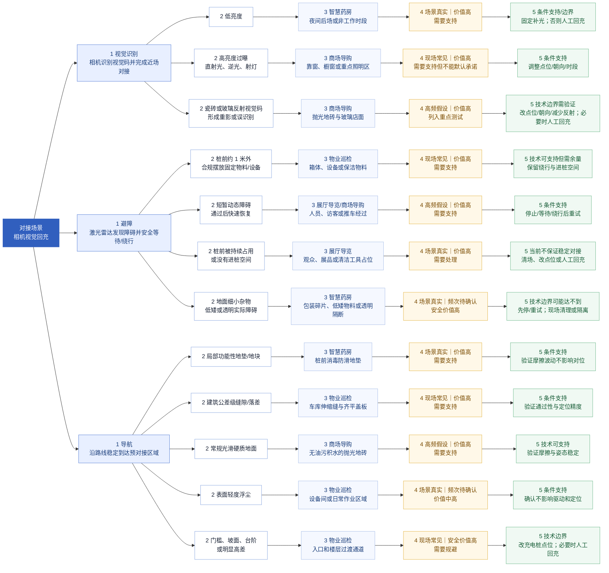

# 相机视觉回充：按视觉、避障、导航划分的场景与技术边界共识稿

> **文档状态**：评审草稿  
> **适用对象**：产品、算法、导航、硬件、测试、交付  
> **当前产品基线**：导览 App / T1 / 相机视觉近场对接方案  
> **本文目的**：沿用评审图的三条主干，统一真实现场情况、技术边界和现场处理方式

## 1. 为什么按三条能力链路分类

当前回充链路由三段能力共同完成：

1. **导航**：机器人从当前点沿已设置路线到达充电桩前的预对接区域。
2. **避障**：激光雷达感知路线和桩前的基础障碍，机器人减速、绕行、等待或停止。
3. **视觉识别**：前置相机在近场识别充电桩视觉码，完成低速对接；检测到真实充电状态后才算回充成功。

因此，本稿的一级维度调整为：

- **视觉**：光照、过曝、反射等是否影响相机识别和近场对接。
- **避障**：动态/静态障碍物和桩前空间是否能被发现、绕开或安全等待。
- **导航**：地面和通行条件是否允许机器人稳定到达预对接区域。

视觉码是否可用、相机是否正常成像、充电桩位置和朝向是否稳定，属于产品质量或部署验收项，不作为场景列出。网络、地图、机器人姿态、控制权和供电属于其他工程问题，不在本次三类能力场景中展开。

同一物理环境按**主要失效机制**归类：瓷砖或玻璃反射视觉码归视觉；瓷砖造成打滑归导航；玻璃门实际挡路归避障。这样保留真实情况，不把同一条规则重复写在多个维度。

## 2. 场景筛选与判断口径

本稿只保留同时满足以下条件的场景：

1. 在展厅导览、物业巡检、商场导购或智慧药房中有明确出现来源。
2. 能说明它会影响识别、避障、导航、安全或回充成功率。
3. 能在真实现场或测试场地复现，并能改变测试优先级、支持承诺或现场处理。

没有现场统计时，使用“高频假设”或“频次待现场确认”，不把理论上可能发生的长尾情况写成高频事实。

| 判断项 | 口径 |
| --- | --- |
| 是否需要支持 | 场景真实且价值高；即使当前技术做不到，也要给出环境改造、运营约束或人工处理。 |
| 技术可支持 | 当前能力可以作为重点测试对象，并有机会建立稳定成功率基线。 |
| 条件支持 | 场景真实，但需要单独验证、清场、调整时段/点位或改善环境。 |
| 技术边界可能达不到 | 当前能力难以稳定处理，不做默认承诺，优先使用简单替代方案。 |

## 3. 从左向右的五层场景思维导图

这类图通常称为**从左向右展开的思维导图**或**左到右树状思维导图**。根节点在左侧，信息逐层向右展开；Mermaid 使用 `flowchart LR`。

每条分支均按五层展开：**1 能力维度 → 2 具体情况 → 3 典型业务场景 → 4 是否需要支持 → 5 技术支持或简单替代方案**。结构沿用你提供的“对接场景 → 识别 / 避障 / 导航”图片，并补充了每条分支的判断层。

## 4. 视觉识别维度

视觉维度只判断“相机能否在真实环境中识别视觉码并完成近场对接”，不把视觉码可用、相机成像正常等质量问题当作场景。

| 具体情况 | 典型业务场景与出现依据 | 是否需要支持 | 技术边界与简单处理 |
| --- | --- | --- | --- |
| 低亮度 | **智慧药房：** 夜间后场或非工作时段可能关闭部分照明，这是明确的运营时段场景。价值高，频次需现场确认。 | 是 | **条件支持/边界：** 通过固定补光满足；无法补光时人工回充，不把完全无光作为默认支持。 |
| 高亮度过曝、直射光、逆光或射灯直射 | **商场导购：** 靠窗、橱窗和重点照明区是实际选点中会遇到的光照环境。价值高，现场常见。 | 是，但不默认稳定承诺 | **条件支持：** 调整桩位、朝向或回充时段；仍受干扰时人工回充。 |
| 抛光瓷砖或玻璃墙面反射视觉码，形成重影或误识别 | **商场导购：** 抛光地砖与玻璃店面在商场常见；展厅也可能有玻璃展柜和高反光地面。价值高，应真实复现。 | 是，列为重点测试 | **技术边界需验证：** 测试不同距离、入射角和照明；不稳定时调整桩位/朝向、避开反射面或减少反射，必要时人工回充。 |

### 视觉判断

- 视觉反射必须保留，归入**视觉**，不是把“瓷砖”本身作为导航问题处理。
- 稳定室内照明是第一组基线；低亮度和过曝是条件测试；瓷砖/玻璃反射是高频高价值专项测试。
- 只有完成真实场地复现和成功率测试后，才能把条件支持提升为默认支持。

## 5. 避障维度

避障维度判断的是激光雷达基础障碍检测与停止、等待、绕行、恢复能力。当前策略较简单，不能假设所有障碍物都能被稳定发现。

| 具体情况 | 典型业务场景与出现依据 | 是否需要支持 | 技术边界与简单处理 |
| --- | --- | --- | --- |
| 充电桩前约 1 米范围外合规摆放固定物料/设备，并保留进桩空间 | **物业巡检：** 箱体、设备和保洁物料会出现在固定路线，属于现场日常物料。价值高。 | 是 | **技术可支持但需余量：** 物料不侵入桩前对接空间，保留导航和绕行余量。 |
| 人员、访客、购物车或推车短暂经过，经过后可快速恢复 | **展厅导览/商场导购：** 访客和推车是营业场地的常态。频次高，价值高。 | 是，重点支持 | **条件支持：** 受阻时停止或等待；障碍离开后重新规划/重试。需要避障重试逻辑，不能直接重复撞向障碍。 |
| 充电桩前被人员、展品、箱体或清洁工具持续占用 | **展厅导览：** 公共展厅的桩前区域容易被观众或物品占用。场景真实，价值高。 | 是，需要明确处理 | **当前不保证稳定对接：** 清空桩前区域、调整点位或安排清场时段；无法清空时人工回充。 |
| 地面细小杂物、低矮物料、透明隔断等实际障碍 | **智慧药房：** 包装碎片、低矮周转箱、透明设施可能出现在后场，但频次需现场确认。安全价值高。 | 是，按安全要求处理 | **技术边界可能达不到：** 先停、短时重试或请求人工确认；现场清理、隔离或改变通道，不依赖自动穿过。 |

### 避障判断

- “短暂动态障碍 → 通过后快速恢复”是需要保留的核心交互，必须有停止、等待、重新规划/重试逻辑。
- “持续占用”与“短暂经过”不是同一种情况：前者需要清场或人工处理，不能无限重试。
- 固定物料、人员/推车、桩前占用和细小/透明障碍均有业务来源；没有现场频次统计的条目标记为待确认，不直接写成默认支持。

## 6. 导航维度

导航维度判断机器人能否在真实地面和通行条件下稳定到达预对接区域。地面反光若影响视觉码识别，仍回到视觉维度；本节重点看通行、摩擦、定位和姿态稳定。

| 具体情况 | 典型业务场景与出现依据 | 是否需要支持 | 技术边界与简单处理 |
| --- | --- | --- | --- |
| 局部功能性地垫/地块 | **智慧药房：** 充电桩前铺设消毒防滑地垫以满足院感要求，摩擦力会有小幅变化。场景有明确业务原因，价值高。 | 是，重点验证 | **条件支持：** 验证摩擦波动不影响底盘对位和定位精度；必要时固定或更换地垫。 |
| 建筑公差级缝隙/落差 | **物业巡检：** 地下车库伸缩缝和齐平盖板属于建筑正常条件。场景真实，价值高。 | 是 | **条件支持：** 验证通过性、定位精度和对接姿态，不把明显高差与建筑公差混为一类。 |
| 常规光滑硬质地面 | **商场导购：** 无油污、无积水的抛光地砖是商场固定通道的常见地面。频次高，价值高。 | 是，优先支持 | **技术可支持：** 验证摩擦、行驶稳定和到达姿态；地砖反光导致视觉干扰时按视觉维度处理。 |
| 表面轻度浮尘 | **物业巡检：** 设备间或日常作业区域可能有轻度浮尘，属于可通过现场观察确认的运营条件。价值中高，频次待确认。 | 是，条件支持 | **条件支持：** 确认浮尘不影响驱动、定位和对接；若出现明显打滑或粉尘堆积，先清洁再回充。 |
| 门槛、坡面、台阶或明显高差 | **物业巡检：** 入口、楼层过渡和设备区域可能存在高差，是现场勘查可直接确认的条件。安全价值高。 | 是，但以规避为主 | **技术边界：** 把充电桩放在连续平面；无法调整时人工回充，不把明显高差作为稳定自动回充环境。 |

### 导航判断

- 瓷砖、硬质地面、局部地垫、公差级缝隙和轻度浮尘是有明确业务来源的真实情况，应进入验证矩阵。
- “常规光滑硬质地面”可以作为导航基线；“抛光地面反射视觉码”则必须同步进入视觉专项测试。
- 明显门槛、坡面、台阶和高差属于现场点位约束，不通过反复导航重试解决。

## 7. 三类能力的统一结论

### 7.1 首批重点测试与支持基线

- **视觉**：稳定室内照明，无强直射、明显过曝和可见反射干扰。
- **避障**：桩前约 1 米对接区域畅通；路线上的普通固定障碍物可被发现且有绕行空间。
- **导航**：平整、干燥、连续的光滑硬质地面，无明显门槛、坡面和台阶。

### 7.2 真实高价值、但需要条件支持

- 低亮度和昼夜亮度变化：保持固定补光并分别验证。
- 商场/展厅人员和推车：导航段可测试等待、绕行和恢复；进入桩前对接区前必须清场。
- 瓷砖、玻璃墙面反射视觉码：列入重点专项测试，未完成复现前不做稳定承诺。
- 局部地垫、建筑公差级缝隙、轻度浮尘：根据真实场地验证摩擦、通过性和定位精度。

### 7.3 当前技术边界或现场必须处理

- 完全无光、强过曝、频闪或反射形成稳定重影。
- 桩前持续被占用、没有进桩空间或没有绕行余量。
- 透明、低矮、细小障碍物无法被当前基础激光避障稳定发现。
- 湿滑、明显不平、台阶、坡面和明显高差。

简单处理优先级统一为：**补光/改环境 → 清场或调整运营时段 → 调整充电桩点位/朝向 → 人工回充**。充电桩位置或朝向变化后，应重新设置回充位置。

## 8. 最小验证方式

1. 在展厅导览、物业巡检、商场导购、智慧药房各选一个真实或拟部署场地，记录三类能力对应的实际情况。
2. 先测共同基线，再一次只增加一个现场变量，例如低亮度、反射瓷砖、短时人流、局部地垫或轻度浮尘。
3. 对每次失败标记发生在视觉识别、避障等待/恢复、导航到达或近场对接哪一段。
4. 用现场出现频次、回充价值、成功率和改造成本，决定条件支持是否可以提升为默认支持。

## 9. 本轮需要团队确认的共识

- **D1 分类**：是否确认一级维度改为视觉、避障、导航，地面情况归入导航，反射视觉码归入视觉？
- **D2 反射**：是否确认保留“抛光瓷砖/玻璃墙面反射视觉码”作为真实高频候选和重点专项测试项？
- **D3 处理**：是否确认短时动态障碍采用停止/等待/重新规划或重试，持续占用和技术边界场景采用清场、改点位或人工回充？

---

**依据**： [最新自动回充 PRD](https://g97aoekjur.feishu.cn/wiki/YSkAwf0q1im3RfkVBHMcODOanLc) 中已确认的 T1 激光雷达导航与基础障碍检测、前置相机视觉对接、充电桩位置设置及实际充电确认规则；一级分类和具体条目沿用本轮提供的“对接场景”评审图。本文对“高频”的表述目前属于基于四类目标业务场地的产品假设，需用现场勘查和真机测试校正。
