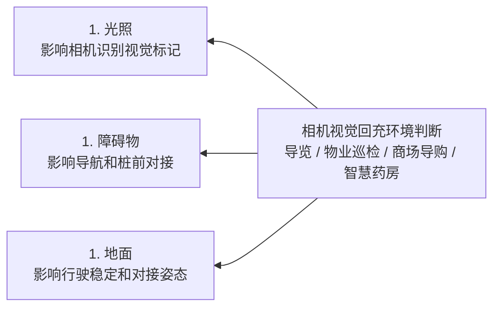
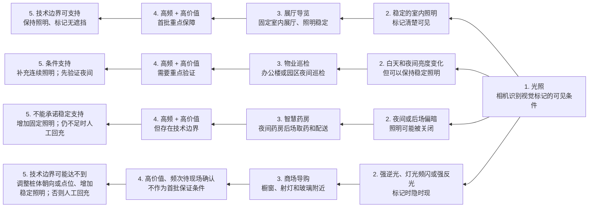
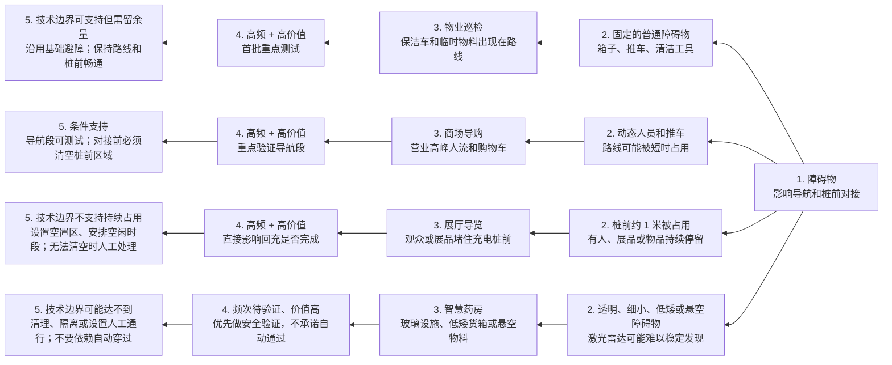
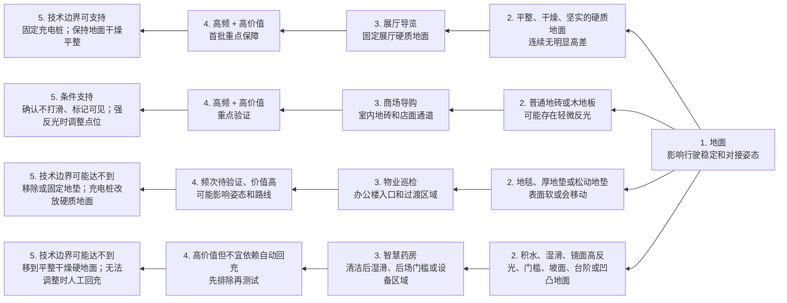

# 导览 App 回充环境适用说明

> **版本**：V1.1  
> **适用产品**：导览 App  
> **适用机型**：T1  
> **适用对象**：部署、运营和现场使用人员

## 先看结论

当前回充方案先沿地图导航到充电桩前的预对接区域，再由前置相机识别充电桩视觉标记并完成近距离对接。激光雷达主要用于导航和基础障碍检测；只有检测到实际充电，才算回充成功。

能否稳定回充，重点看三个环境维度：**光照、障碍物、地面**。不能只按“导览、物业巡检、商场导购或智慧药房”判断是否支持；同一业务在不同现场的结果可能不同。

本文中的“高频、高价值”是首批测试的产品判断，不代表已经完成现场频次统计或成功率承诺。正式部署前，必须在真实场地验证。

## 这种图叫什么

本手册采用**左向思维导图**，也可以称为**从右向左的思维导图**或**左向树状思维导图**：根节点在右侧，信息逐层向左展开。

Markdown 使用 Mermaid 的 `flowchart RL` 表达这种布局。每条分支固定按以下五层阅读：

1. **维度说明**：这一维度影响回充的哪一段。
2. **维度会出现的情况**：现场可能遇到的具体条件。
3. **典型业务场景**：从导览、物业巡检、商场导购、智慧药房中取一个代表。
4. **情况判断**：是否属于高频、高价值，是否应纳入重点支持。
5. **技术边界与处理方式**：当前方案能否支持；不能稳定支持时，现场先做什么。

## 总体判断图

## 1. 光照

光照主要影响**相机能否稳定看到充电桩视觉标记**。导航可以到达桩前，不代表相机一定能完成识别和对接。

**光照判断**：

- 首批优先建立“固定室内、标记清楚、照明稳定”的准确率基线。
- 夜间、后场偏暗是物业巡检和智慧药房的高价值条件；只有在现场能持续补光时，才进入条件支持。
- 强逆光、频闪、强反光和完全黑暗会直接影响视觉识别，不能通过反复点击或重复回充解决。

## 2. 障碍物

障碍物要分两段看：**前往充电桩的导航路线**和**充电桩前的近场对接区域**。当前激光雷达只提供基础障碍检测，不能保证识别所有透明、细小、低矮或悬空物体。

**障碍物判断**：

- 普通、可被发现的障碍物可以作为基础避障能力的测试对象，但要给机器人留下绕行空间。
- 人流可以出现在导航路线上，但**不能在机器人进入近场对接时持续占用桩前区域**。
- 桩前有障碍物时，机器人应停止并等待现场处理；清空后再按页面提示重试，不要把障碍物问题当成视觉故障反复重试。

## 3. 地面

地面主要影响**底盘行驶是否稳定、机器人到达桩前时的姿态是否可控，以及相机对接时是否容易偏移**。

**地面判断**：

- “平整、干燥、坚实的硬质地面”是四类业务都可以复用的首批测试基线。
- 普通地砖和木地板可以测试，但要确认机器人不打滑、相机视野不被强反光干扰。
- 地毯、松动地垫、门槛、坡面、台阶、湿滑和凹凸地面，不应直接作为自动回充的稳定支持环境。

## 重点支持与技术边界

### 需要重点支持并建立准确率基线

以下组合同时具备高频和高价值，建议优先在四类业务中建立测试基线：

- 室内固定场地，照明稳定，视觉标记清楚可见。
- 从任务区域到充电桩的路线基本畅通，普通障碍物可被发现并有绕行空间。
- 充电桩前约 1 米保持空置，进入对接时没有人员、推车、箱子或展品占用。
- 充电桩位于平整、干燥、坚实的硬质地面，并且自身固定不移动。

这组条件适用于：展厅导览的固定展厅、物业巡检的固定室内路线、商场导购的店内路线、智慧药房的后场固定通道。

### 高频高价值，但当前只能条件支持

- 白天和夜间亮度变化：物业巡检、智慧药房常见；需要保持夜间固定照明并验证。
- 营业高峰人流：商场导购、展厅导览常见；导航段可测试，但对接前桩前必须清空。
- 普通地砖、木地板和轻微反光：商场导购、智慧药房常见；先确认不打滑和标记可见。
- 路线上偶发保洁车、物料和推车：物业巡检、商场导购常见；应保持绕行空间，不能堵住桩前。

### 技术边界可能达不到，必须提供现场替代方法

- 强逆光、完全黑暗、灯光频闪、强反光直射相机。
- 视觉标记被遮挡、污损、损坏，或充电桩移动、改变朝向后未重新设置位置。
- 桩前持续有人流或物品占用，无法保持约 1 米空置。
- 透明、细小、低矮、悬空等激光雷达可能难以稳定发现的障碍物。
- 积水、湿滑、镜面高反光、厚地毯、松动地垫、门槛、坡面、台阶和凹凸地面。

现场优先按以下顺序处理：

1. **调整环境**：补充稳定照明、清理桩前区域、移除地垫、把充电桩移到平整干燥硬地面。
2. **重新确认位置**：充电桩移动或改变朝向后，重新设置回充位置。
3. **改用人工处理**：环境无法调整时，由现场人员把机器人移至充电桩处充电，不要连续重复自动回充。

## 上线前检查

- [ ] 充电桩固定，视觉标记清洁、完整且无遮挡。
- [ ] 工作时段和夜间的照明都能保持稳定，没有强逆光、频闪或强反光直射。
- [ ] 从任务区域到充电桩的路线畅通，没有难以稳定发现的透明、细小、低矮或悬空障碍物。
- [ ] 充电桩前约 1 米没有人员、推车、箱子、清洁工具或展品占用。
- [ ] 充电桩所在位置平整、干燥、坚实，没有地垫、门槛、坡面、台阶或明显打滑风险。
- [ ] 充电桩位置或朝向变化后，已经重新设置回充位置。
- [ ] 现场实际验证确认设备进入“充电中”，而不是只到达充电桩前。

## 回充失败时

先按失败阶段判断：

- **还没到桩前**：检查路线、临时障碍物和地面高差。
- **到桩前但找不到标记**：检查照明、相机视野、标记遮挡和充电桩朝向。
- **识别后没有完成对接**：清空桩前区域，检查地面是否打滑或反光，再按提示重试。
- **已经到桩但没有进入充电中**：不要视为成功；检查充电桩和接触状态，必要时人工处理。

同一现场反复失败时，不要只重复操作。优先调整光照、障碍物和地面；无法调整时，改用人工回充并记录现场条件，供后续现场验证。

---

**依据**： [最新自动回充 PRD](https://g97aoekjur.feishu.cn/wiki/YSkAwf0q1im3RfkVBHMcODOanLc) 中已确认的 T1 激光雷达导航与基础障碍检测、前置相机视觉对接、充电桩位置设置及实际充电确认规则。本文的“高频、高价值”分级和现场替代方法属于部署建议，不能替代真实场地测试，也不代表其他机型的能力边界。
